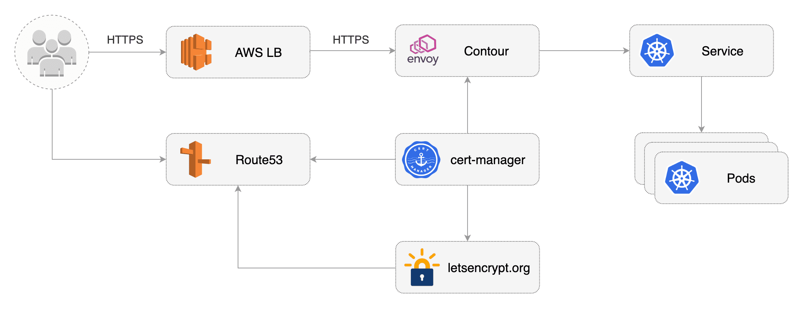
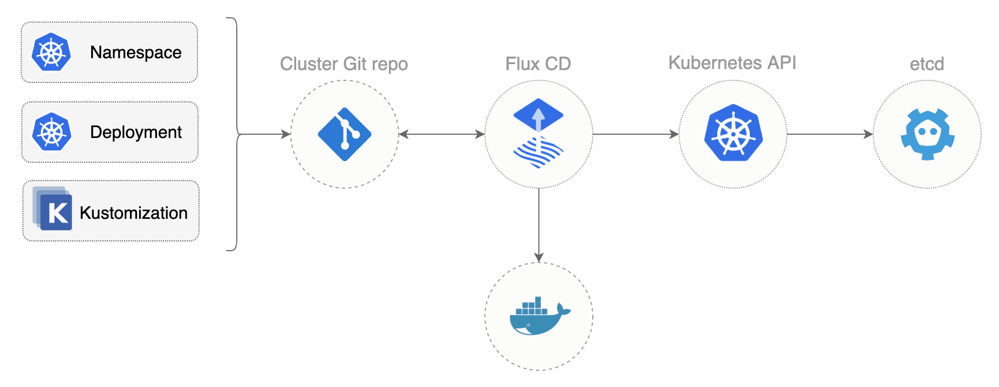

# eks-contour-ingress

[](https://github.com/stefanprodan/eks-contour-ingress/actions)

In Kubernetes terminology, [Ingress](https://kubernetes.io/docs/concepts/services-networking/ingress/) exposes HTTP(S) routes from outside the cluster to services running within the cluster. 
An Ingress can be configured to provide Kubernetes services with externally-reachable URLs while performing load balancing and SSL/TLS termination.

Kubernetes comes with an Ingress resource and there are several controllers that implement the ingress specification like the ELB ingress controller or NGINX.
The Kubernetes Ingress specification is very limited thus most controllers had to rely on annotations to extend the routing features beyond the basics of what Ingress allows.
But even with annotations there are some limitations hard to overcome, like cross-namespaces routing or weighted load balancing.

[Contour](https://projectcontour.io) (soon to be a [CNCF project](https://github.com/cncf/toc/pull/330)) is a modern ingress controller based on [Envoy](https://www.envoyproxy.io/) that expands upon the functionality of the Ingress API with a new specification named HTTPProxy.
The HTTPProxy API allows for a richer user experience and addresses the limitations of the Ingress use in multi-tenant environments.

The HTTPProxy specification is flexible enough to facilitate advanced L7 routing policies based on HTTP header or cookie filters as well as weighted load balancing between Kubernetes services.
These features make Contour suitable for automating Canary releases and A/B testing with [Flagger](https://flagger.app).

This guide shows you how to set up a [GitOps](https://www.weave.works/blog/kubernetes-anti-patterns-let-s-do-gitops-not-ciops)
pipeline to securely expose Kubernetes services over HTTPS using:
* Amazon EKS and Route 53
* [cert-manager](https://cert-manager.io) to provision TLS certificates from [Let's Encrypt](https://letsencrypt.org)
* Contour as the ingress controller
* [Flux](https://fluxcd.io) as the GitOps operator
* [podinfo](https://github.com/stefanprodan/podinfo) as the demo web application



### Create an EKS cluster

You'll need an AWS account, a GitHub account, git and kubectl installed locally.

Install [eksctl](https://eksctl.io):

```sh
# macOS
brew tap weaveworks/tap
brew install weaveworks/tap/eksctl

# Windows
choco install eksctl
```

For Linux you can download the eksctl binary from [GitHub releases](https://github.com/weaveworks/eksctl/releases).

Create an EKS cluster with four EC2 nodes:

```sh
cat << EOF | eksctl create cluster -f -
apiVersion: eksctl.io/v1alpha5
kind: ClusterConfig
metadata:
  name: my-cluster
  region: eu-west-1
nodeGroups:
  - name: controllers
    labels: { role: controllers }
    instanceType: m5.large
    desiredCapacity: 2
    iam:
      withAddonPolicies:
        certManager: true
        albIngress: true
    taints:
      controllers: "true:NoSchedule"
managedNodeGroups:
  - name: workers
    labels: { role: workers }
    instanceType: m5.large
    desiredCapacity: 2
    volumeSize: 120
EOF
```

The above command creates an EKS cluster with two node groups:
* The **controllers** node group has the IAM roles needed by cert-manager to solve DNS01 ACME challenges and will be used to run 
the Envoy proxy DaemonSet along with Contour and cert-manager.
* The **workers** managed node group is for the apps that will be exposed outside the cluster by Envoy.

A Kustomize patch is used to pin the workloads on node groups with selectors and tolerations, for example:

```yaml
# contour/node-selector-patch.yaml
apiVersion: apps/v1
kind: DaemonSet
metadata:
  name: envoy
  namespace: projectcontour
spec:
  template:
    spec:
      nodeSelector:
        role: controllers
      tolerations:
        - key: controllers
          operator: Exists
```

We use Kustomize patches to avoid modifying the original manifests. You can update the manifests by running
`./scripts/update-manifests.sh`, this script downloads the latest cert-manager and Contour YAML and overrides the manifests in the repo.

### Install Flux

[Flux](https://fluxcd.io) is a GitOps operator for Kubernetes that keeps your cluster state is sync with a Git repository.
Because Flux is pull based and also runs inside Kubernetes, you don't have to expose the cluster
credentials outside your production environment.

You can define the desired state of your cluster with Kubernetes YAML manifests and customise them with Kustomize.
Flux implements a control loop that continuously applies the desired state to your cluster,
offering protection against harmful actions like deployments deletion or policies altering.



Install [fluxctl](https://github.com/fluxcd/flux/releases):

```sh
# macOS
brew install fluxctl

# Windows
choco install fluxctl

# Linux
curl -sL https://fluxcd.io/install | sh
```

On GitHub, [fork](https://help.github.com/en/github/getting-started-with-github/fork-a-repo) this repository and clone it locally (replace `stefanprodan` with your GitHub username): 

```sh
git clone https://github.com/stefanprodan/eks-contour-ingress
cd eks-contour-ingress
```

Create the fluxcd namespace:

```sh
kubectl create ns fluxcd
```

Install Flux by specifying your fork URL (replace `stefanprodan` with your GitHub username): 

```bash
export GHUSER="stefanprodan" && \
fluxctl install \
--git-user=${GHUSER} \
--git-email=${GHUSER}@users.noreply.github.com \
--git-url=git@github.com:${GHUSER}/eks-contour-ingress \
--git-branch=master \
--manifest-generation=true \
--namespace=fluxcd | kubectl apply -f -
```

### Setup Git sync

At startup, Flux generates a SSH key and logs the public key. Find the public key with:

```bash
fluxctl identity --k8s-fwd-ns fluxcd
```

In order to sync your cluster state with git you need to copy the public key and 
create a **deploy key** with **write access** on your GitHub repository.

Open GitHub, navigate to your repository, go to _Settings > Deploy keys_ click on _Add deploy key_, check 
_Allow write access_, paste the Flux public key and click _Add key_.

After a couple of seconds Flux will deploy Contour, cert-manager and podinfo in your cluster.

Check the sync status with:

```
watch kubectl get pods --all-namespaces
```

### Configure DNS

Retrieve the external address of Contour's Envoy load balancer:

```
kubectl get -n projectcontour service envoy -o wide

NAME    TYPE           CLUSTER-IP      EXTERNAL-IP
envoy   LoadBalancer   10.100.228.53   af4726981288e11eaade7062a36c250a-1448602599.eu-west-1.elb.amazonaws.com
```

Using the external address create a CNAME record in Route53 e.g. `*.example.com` that maps to the LB address.

Verify your DNS setup using the `host` command:

```
host podinfo.example.com

podinfo.example.com is an alias for af4726981288e11eaade7062a36c250a-1448602599.eu-west-1.elb.amazonaws.com.
```

### Obtain Let's Encrypt wildcard certificate

In order to obtain certificates from Let's Encrypt you need to prove ownership by 
creating a TXT record with specific content that proves you have control of the domain DNS records.
The DNS challenge and cert renewal can be fully automated with cert-manager and Route53.


Create a cluster issues with Let's Encrypt DNS01 solver (replace `stefanprodan` with your GitHub username):

```sh
export GHUSER="stefanprodan" && \
cat << EOF | tee ingress/issuer.yaml
apiVersion: cert-manager.io/v1alpha2
kind: ClusterIssuer
metadata:
  name: letsencrypt-prod
  annotations:
    fluxcd.io/ignore: "false"
spec:
  acme:
    email: ${GHUSER}@users.noreply.github.com
    privateKeySecretRef:
      name: letsencrypt-prod
    server: https://acme-v02.api.letsencrypt.org/directory
    solvers:
    - dns01:
        route53:
          region: eu-west-1
EOF
```

Create a certificate in the `projectcontour` namespace (replace `example.com` with your domain):

```sh
export DOMAIN="example.com" && \
cat << EOF | tee ingress/cert.yaml
apiVersion: cert-manager.io/v1alpha2
kind: Certificate
metadata:
  name: cert
  namespace: projectcontour
  annotations:
    fluxcd.io/ignore: "false"
spec:
  secretName: cert
  commonName: "*.${DOMAIN}"
  dnsNames:
  - "*.${DOMAIN}"
  issuerRef:
    name: letsencrypt-prod
    kind: ClusterIssuer
EOF
```

Apply changes via git:

```sh
git add -A && \
git commit -m "add wildcard cert" && \
git push origin master && \
fluxctl sync --k8s-fwd-ns fluxcd
```

Note that Flux does a git-cluster reconciliation every five minutes,
the `fluxctl sync` command can be used to speed up the synchronization.

Wait for the certificate to be issued (it takes up to two minutes):

```sh
watch kubectl -n projectcontour describe certificate

Events:
  Type    Reason        Age    From          Message
  ----    ------        ----   ----          -------
  Normal  GeneratedKey  2m17s  cert-manager  Generated a new private key
  Normal  Requested     2m17s  cert-manager  Created new CertificateRequest resource "cert-1178588226"
  Normal  Issued        20s    cert-manager  Certificate issued successfully
```

When the certificate has been issued, cert-manager will create a secret with the TLS cert:

```sh
kubectl -n projectcontour get secrets

NAME                  TYPE                                  DATA   AGE
cert                  kubernetes.io/tls                     3      5m40s
```

We store the certificate in the Contour namespace so that we can reuse it for multiple apps deployed in different namespaces.

### Expose services over TLS

In order to expose the demo app podinfo outside the cluster you'll be using Contour's HTTPProxy custom resource definition. 

Create a HTTPProxy by referencing the TLS cert secret (replace `example.com` with your domain):

```sh
export DOMAIN="example.com" && \
cat << EOF | tee ingress/proxy.yaml
apiVersion: projectcontour.io/v1
kind: HTTPProxy
metadata:
  name: podinfo
  namespace: projectcontour
  annotations:
    fluxcd.io/ignore: "false"
spec:
  virtualhost:
    fqdn: podinfo.${DOMAIN}
    tls:
      secretName: cert
  includes:
    - name: podinfo
      namespace: demo
EOF
```

HTTPProxies can include other HTTPProxy objects, the above configuration includes the podinfo HTTPProxy from the demo namespace:

```sh
cat podinfo/proxy.yaml

apiVersion: projectcontour.io/v1
kind: HTTPProxy
metadata:
  name: podinfo
  namespace: demo
spec:
  routes:
    - services:
        - name: podinfo
          port: 9898
```

We use the cross namespace inclusion to be able to load the shared TLS wildcard certificate.

Apply changes via git:

```sh
git add -A && \
git commit -m "expose podinfo" && \
git push origin master && \
fluxctl sync --k8s-fwd-ns fluxcd
```

When TLS is enabled for a virtual host, Contour will redirect the traffic to the secure interface:

```sh
curl -vL podinfo.example.com

< HTTP/1.1 301 Moved Permanently
< location: https://podinfo.example.com/
```

### Progressive Delivery

Progressive delivery is an umbrella term for advanced deployment patterns like canaries, feature flags and A/B testing.
Progressive delivery techniques are used to reduce the risk of introducing a new software version in production by
giving app developers and SRE teams a fine-grained control over the blast radius.


You can use [Flagger](https://github.com/weaveworks/flagger) together with Contour's HTTPProxy to
automate canary releases and A/B testing for your web apps.
When using Flagger you would replace the podinfo service and proxy definitions with a canary definition. Flagger generates the
Kubernetes ClusterIP services and Contour HTTPProxy on its own based on the canary spec.

When you deploy a new version of an app, Flagger gradually shifts traffic to the canary, and at the same time,
measures the requests success rate as well as the average response duration, these metrics are provided by Envoy and collected by Prometheus.
You can extend the canary analysis with custom Prometheus metrics, acceptance and load testing to harden the validation process of your app release process.

If you want to give Flagger a try, here is the Contour [progressive delivery tutorial](https://docs.flagger.app/usage/contour-progressive-delivery).
